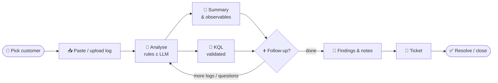
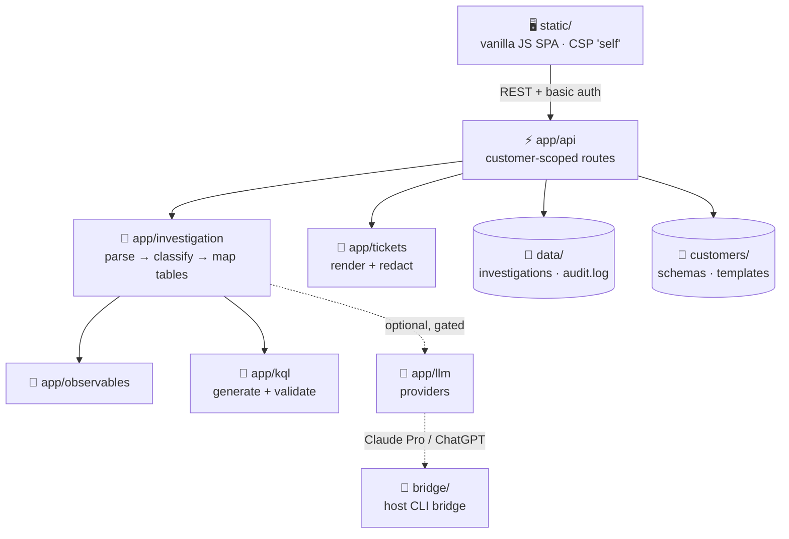

<div align="center">


# SOC Investigation Interface

**Local-first triage for security events across many customers.**<br>
A single log becomes the event type, the customer's own tables, observables, validated KQL, hypotheses and a finished ticket.


[Quick start](#-quick-start) •
[Workflow](#-workflow) •
[Architecture](#-architecture) •
[Configuration](#%EF%B8%8F-configuration) •
[Security](#-security) •
[Docs](#-documentation) •
[Changelog](CHANGELOG.md)

</div>

---

## ✨ Highlights

| | |
|---|---|
| 🏢 **Multi-customer** | Each customer has its own schemas, KQL conventions, investigation notes and ticket template. Their data stays separate on disk and in every API route. |
| 🔎 **Understands raw logs** | Accepts JSON, JSON lines, CSV, key=value, syslog/CEF and free text. Extracts observables, including defanged indicators. |
| 🧭 **Customer-specific KQL** | Queries are built from that customer's own table and field names, then validated offline. The app **never executes** them. |
| ➕ **Follow-ups** | Add Defender evidence, more raw logs or questions after the first analysis. Each follow-up's output appears under the timeline. |
| 🎫 **Tickets your way** | A template editor with a live preview, plus a **SOC standard** template (Subject / When (UK time) / Who / Where / Why / Actions). |
| 🤖 **Optional LLM** | Claude Pro, ChatGPT, the Anthropic, OpenAI and Gemini APIs, any OpenAI-compatible API, or a local Ollama model. Off by default, gated per customer, and labelled whenever used. |
| 🗂️ **Schema catalog** | About 305 Sentinel and Defender XDR tables pulled from Microsoft Learn. Tick the tables each customer actually has. |
| 🌗 **Light / dark** | Follows your system theme. Press <kbd>T</kbd> to toggle. |

## 🚀 Quick start

```bash
cp .env.example .env                    # defaults: localhost only, no LLM
cp -r samples/customers/*/ customers/   # optional: fictional sample customers
docker compose up -d --build            # → http://127.0.0.1:8090
```

> [!TIP]
> **On Windows?** Add the Docker Desktop override: `docker compose -f docker-compose.yml -f docker-compose.windows.yml up -d --build`. See [docs/windows.md](docs/windows.md) for the Ollama/GPU setup.

<details>
<summary><b>Other commands</b></summary>

```bash
docker compose logs --tail 50 soc     # logs
docker compose down                   # stop

# without Docker
python3 -m venv .venv
.venv/bin/pip install -r requirements-dev.txt
.venv/bin/uvicorn app.main:app --port 8090

# tests
.venv/bin/python -m pytest -q
```

</details>

> [!IMPORTANT]
> **Exposing the app beyond localhost:**
> - Set `SOC_BIND_ADDR=0.0.0.0` (or a LAN IP) **and** `SOC_AUTH_PASSWORD` in `.env`. Without the password, the app refuses to start.
> - If it is reachable from outside the host, put it behind TLS (a reverse proxy).

## 🧭 Workflow



| Step | What you get |
|---|---|
| **1. Select a customer** | The sidebar lists only that customer's investigations. |
| **2. New investigation** | Paste a log or upload a file (text only, 5 MB max). Add optional context and choose the analysis mode. The investigation gets an ID like `INV-2026-000123`. |
| **3. Summary** | The event types with their evidence. Facts are separated into **Observed / Inferred / Unknown**. Recommended steps include the customer's own investigation notes. |
| **4. KQL** | Each query card shows its purpose, time range, field rationale, expected result and a local validation badge. You can edit a query and re-validate it, or use the scratchpad. |
| **5. Follow-up** | Add **more logs** (Defender alert or evidence, hunting results, raw logs) or a **question / general input**. Each log is parsed separately and its observables are merged. With an LLM, the latest question gets an answer, and *"create a ticket…"* generates one. |
| **6. Findings & notes** | Record the outcome, why / risk, action taken by SOC and action for the client. After an LLM analysis, the LLM's draft of each appears under its box. |
| **7. Ticket** | Fill in the customer's template, then edit, copy or download the result. Open **Ticket template** to edit the template, with placeholder chips, a live preview and starter templates. |
| **8. Status** | New → Investigating → Pending Information → Escalated → Resolved → Closed. Every change is recorded in History. |

### 🎫 Where ticket content comes from

| Section | Source |
|---|---|
| 🕒 When (UK time), 👤 Who, 📍 Where, observables, evidence | **Extracted from the logs**, never from the LLM |
| 📝 Description, ✅ Outcome, ⚠️ Why, 📋 Client actions | **Your text** if you wrote it, otherwise the **LLM draft** (labelled *"LLM draft, review before sending"*), otherwise a rules-based fallback |
| 🛡️ Action taken by SOC | Your text, then what the record shows was done. KQL is listed as *prepared*, never *run*. |
| 🚦 Severity | Always set by you |

> [!TIP]
> **Schema catalog:**
> 1. Go to **Schema catalog** → **Pull from Microsoft**.
> 2. Go to **Customer config** → **Schema selection**, tick the customer's tables, then click **Apply**.
>
> From then on, that customer's analysis uses only those tables. See [docs/customers.md](docs/customers.md).

## 🏗️ Architecture



<details>
<summary><b>📁 Repository layout</b></summary>

```
static/            vanilla JS SPA (no build, no CDN, CSP 'self', textContent only)
app/main.py        FastAPI app: basic auth, security headers, static files
app/api/routes.py  REST API; all investigation routes are /customers/{cid}/investigations/{id}
app/customers/     customer.md + schemas/*.md parser → TableSchema (fields + roles)
app/investigation/ parser (JSON/CSV/KV/text) → classifier (playbooks) → table mapping → engine
app/observables/   IOC/entity extraction (defang-aware, key-aware, internal/external IP tags)
app/kql/           generator (role-based query builders) and local validator
app/llm/           providers: Claude Pro / ChatGPT via host bridge, Anthropic, OpenAI, Gemini, OpenAI-compatible, Ollama
app/tickets/       {{placeholder}} renderer with Unknown handling and secret redaction
app/storage/       JSON file per investigation under data/investigations/<customer>/
app/audit.py       JSONL audit log (actions and metadata only, never log content)
app/catalog/       schema catalog: pull from Microsoft Learn, categories, per-customer table selection
bridge/            host-side HTTP bridge to the Claude Code CLI (+ systemd unit)
catalog/           schema-catalog.md (all schemas, tables and columns)
customers/         live customer data (git-ignored except _template/ and the fictional woodgrove/)
samples/customers/ fictional sample customers, also used by the tests
templates/         default ticket templates (incident, SOC standard)
.claude/           Claude Code agents and skills for developing this project
```

Every folder has its own `README.md` describing its files.

</details>

- 🐳 `./customers` and `./data` are bind-mounted into the container.
- 🔒 The container is read-only and runs as non-root, with all capabilities dropped and `no-new-privileges` set.
- 🧩 **To add an event type:** add a playbook to `app/investigation/playbooks.py`, then map it to query builders in `PLAN` in `app/kql/generator.py`.

## ⚙️ Configuration

<details open>
<summary><b>Environment variables</b></summary>

| Variable | Default | Purpose |
|---|---|---|
| `SOC_BIND_ADDR` | `127.0.0.1` | Host address the port is published on. A non-local address requires auth. |
| `SOC_PORT` | `8090` | Host port |
| `SOC_AUTH_USER` / `SOC_AUTH_PASSWORD` | `analyst` / empty | HTTP Basic auth, enabled when a password is set |
| `SOC_UID` / `SOC_GID` | `1000` | Container user. It must be able to write `./data` and `./customers`. |
| `SOC_MAX_UPLOAD_BYTES` | `5242880` | Upload size limit |
| `SOC_MAX_LOG_CHARS` | `2000000` | Size limit for a pasted log (including follow-up logs) |
| `LLM_PROVIDER` | `none` | `none` · `claude_pro` · `chatgpt` · `anthropic` · `openai` · `gemini` · `openai_compatible` · `ollama` |
| `LLM_ALLOW_EXTERNAL` | `false` | Global kill switch for external LLMs |
| `LLM_TIMEOUT_SECONDS` | `240` | Timeout for each LLM request |
| `LLM_MAX_LOG_CHARS` / `LLM_MAX_CONTEXT_CHARS` | `60000` / `120000` | Truncation applied before anything is sent to an LLM |
| `ANTHROPIC_API_KEY` / `ANTHROPIC_MODEL` / `ANTHROPIC_EFFORT` | – / `claude-opus-5-5` / `medium` | Claude API |
| `CLAUDE_BRIDGE_URL` / `CLAUDE_BRIDGE_TOKEN` / `CLAUDE_CLI_MODEL` | `http://host.docker.internal:8765` / – / CLI default | Claude Code CLI bridge |
| `SOC_CATALOG_PATH` / `CATALOG_FETCH_ENABLED` | `catalog/schema-catalog.md` / `true` | Schema catalog file, and whether pulling from learn.microsoft.com is allowed |
| `OLLAMA_URL` / `OLLAMA_MODEL` / `OLLAMA_IS_LOCAL` | `http://host.docker.internal:11434` / `llama3.1:8b` / `true` | Ollama |
| `OLLAMA_NUM_CTX` / `OLLAMA_THINK` | `8192` / `false` | Ollama context window (tokens) and reasoning mode (qwen3, deepseek-r1) |

</details>

## 🔐 Security

| | |
|---|---|
| 🏠 **Local by default** | No LLM is used, and the app binds to `127.0.0.1`. |
| 🤖 **External LLM gates** | External use needs the global switch, a per-customer allowance **and** confirmation from the analyst on each run. It is labelled in the UI and recorded per investigation and in the audit log. |
| 🔑 **Secrets** | API keys come from environment variables, or are stored with mode 0600. Secrets are redacted from tickets and from LLM prompts. |
| 🧱 **Customer separation** | Data is split by customer on disk. Every route is scoped to one customer, and IDs are checked against path traversal. |
| 📤 **Uploads** | Size-limited. Binary files are rejected and control characters are stripped. |
| 📜 **Audit log** | `data/audit.log` (JSONL) records actions and metadata only, never log content. |
| 🙈 **No customer data in git** | `customers/*` (except `_template/` and the fictional `woodgrove/`), `data/`, `.env` and `.env.bridge` are git-ignored. |

## 📚 Documentation

| Doc | About |
|---|---|
| 🏢 [docs/customers.md](docs/customers.md) | Adding customers, schema format, field roles, KQL validation, schema catalog |
| 🎫 [docs/tickets.md](docs/tickets.md) | Ticket templates, the template editor, the SOC standard template, placeholders |
| ➕ [docs/followups.md](docs/followups.md) | Follow-up logs and questions after the first analysis |
| 🤖 [docs/llm.md](docs/llm.md) | LLM providers, external-LLM switches, exactly what data is sent |
| 🪟 [docs/windows.md](docs/windows.md) | Running on Windows with Docker Desktop and a local Ollama model on an NVIDIA GPU |
| 🧩 [docs/adding-an-llm.md](docs/adding-an-llm.md) | How to add another LLM provider |
| 📝 [CHANGELOG.md](CHANGELOG.md) | Notable changes by date |

<div align="center">
<sub>Built for SOC analysts · runs happily on a Raspberry Pi 5 🍓</sub>
</div>
