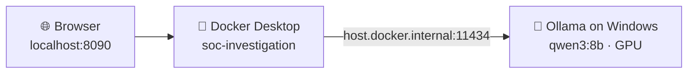

# 🪟 Running on Windows (with a local Ollama model)

This guide runs the app on Windows 10 or 11 instead of the Raspberry Pi, using a local Ollama model on an NVIDIA GPU. The example setup is `qwen3:8b` on a GTX 1660 Ti with 6 GB of VRAM. The app runs in a container under Docker Desktop. Ollama runs natively on Windows, so it has direct access to the GPU.



## What changes compared with the Pi

| | Raspberry Pi | Windows |
|---|---|---|
| Start command | `docker compose up -d --build` | adds `-f docker-compose.windows.yml` (see below) |
| `host.docker.internal` | pinned to the Linux bridge gateway (for the Claude CLI bridge) | Docker Desktop's own address for the Windows host, where Ollama runs |
| LLM | Claude Pro / ChatGPT through the host bridge | Ollama, local. No data leaves the PC. |
| Prompt size | large (Claude) | smaller, to fit an 8B model's context window and 6 GB of VRAM |
| Claude CLI bridge | systemd user service | optional; there is no systemd, so start it by hand (see the end of this guide) |

Everything else is the same: the code, image, customers, templates and tests.

## 1. Install the prerequisites

1. **WSL 2.** In an admin PowerShell, run `wsl --install`, then reboot.
2. **[Docker Desktop](https://www.docker.com/products/docker-desktop/)**, using the WSL 2 backend. That's the default.
3. **[Git for Windows](https://git-scm.com/download/win)**.
4. **Ollama.** You already have it. Check that the model is installed:

   ```powershell
   ollama list            # qwen3:8b should be listed
   ```

## 2. Get the code

```powershell
cd $HOME
git clone https://github.com/Strawhatluffy007/soc-investigation.git
cd soc-investigation
```

The repository is private, so Git asks you to sign in. Use the browser login, or the GitHub CLI with `gh auth login`.

> [!NOTE]
> `.gitattributes` keeps every file with LF line endings, so Git for Windows doesn't convert them to CRLF.

## 3. Configure `.env`

```powershell
Copy-Item .env.example .env
notepad .env
```

Set these values (everything else can stay as it is):

```ini
LLM_PROVIDER=ollama
OLLAMA_URL=http://host.docker.internal:11434
OLLAMA_MODEL=qwen3:8b
OLLAMA_IS_LOCAL=true
OLLAMA_THINK=false

# Sized for an 8B model on a 6 GB GPU
OLLAMA_NUM_CTX=12288
LLM_MAX_LOG_CHARS=16000
LLM_MAX_CONTEXT_CHARS=12000
LLM_TIMEOUT_SECONDS=600

TZ=Europe/London
```

What these settings do:

| Setting | Why |
|---|---|
| `OLLAMA_NUM_CTX` | Ollama's default context window is small, and it **silently drops the start of a longer prompt**, which includes the instructions. 12288 tokens holds the prompt plus the JSON reply. |
| `LLM_MAX_LOG_CHARS` / `LLM_MAX_CONTEXT_CHARS` | Keep the prompt within that window: about 4 characters per token, with room left for the reply. The customer schema in the prompt is limited to a third of `LLM_MAX_CONTEXT_CHARS`. |
| `OLLAMA_THINK=false` | qwen3 is a reasoning model. With thinking off it answers directly in the required JSON format, which is faster. Any `<think>` text that still appears is removed. |
| `LLM_TIMEOUT_SECONDS` | A local 8B model takes 1 to 4 minutes for a full analysis. |

## 4. Bring your customers across (optional)

The fictional samples come with the repository. To try them:

```powershell
Copy-Item -Recurse samples\customers\* customers\
```

To move your real customers from the Pi, copy them **directly** from the Pi with `scp`. Don't put them in Git, email or cloud storage:

```powershell
scp -r shiv@192.168.0.103:~/claude/soc-investigation/customers/* customers\
scp shiv@192.168.0.103:~/claude/soc-investigation/catalog/schema-catalog.md catalog\
# optional: existing investigations and the audit log
scp -r shiv@192.168.0.103:~/claude/soc-investigation/data/* data\
```

## 5. Start the app

```powershell
docker compose -f docker-compose.yml -f docker-compose.windows.yml up -d --build
```

Then open **http://127.0.0.1:8090**.

`docker-compose.windows.yml` points `host.docker.internal` back at the Windows host (`host-gateway`), so the container can reach Ollama. It also raises the container's memory limit to 1 GB.

Check that the container can reach Ollama:

```powershell
docker exec soc-investigation python -c "import urllib.request;print(urllib.request.urlopen('http://host.docker.internal:11434/api/tags').read()[:200])"
```

If that fails, Ollama is probably listening only on `127.0.0.1` and the connection isn't being forwarded:

1. Quit Ollama from the system tray.
2. Set a user environment variable: `setx OLLAMA_HOST 0.0.0.0:11434`.
3. Start Ollama again.

> [!WARNING]
> `OLLAMA_HOST=0.0.0.0` makes Ollama listen on every network interface. Make sure Windows Defender Firewall blocks inbound port **11434** from other machines. Allow it only on the Docker/WSL adapter, or keep the network profile set to *Public*, which blocks inbound connections by default.

## 6. Select Ollama in the app

1. Pick a customer, then open **LLM settings**. Choose **Ollama** and set the model to `qwen3:8b`.
2. Ollama is local, so the external-LLM switch and the per-run confirmation don't apply.
3. Start an investigation with **Use LLM** ticked.

To check that the model runs on the GPU, run this during an analysis:

```powershell
ollama ps     # PROCESSOR should say 100% GPU, or mostly GPU
```

## 🚀 Getting the most from a 6 GB GPU

`qwen3:8b` (Q4) takes about 5.2 GB, and the context window needs extra memory on top of that. Ollama moves whatever doesn't fit onto the CPU, which slows it down.

| Tip | How |
|---|---|
| Smaller context memory | `setx OLLAMA_FLASH_ATTENTION 1` and `setx OLLAMA_KV_CACHE_TYPE q8_0`, then restart Ollama. This roughly halves the memory the context window needs. |
| Shorter window | Use `OLLAMA_NUM_CTX=8192`, `LLM_MAX_LOG_CHARS=10000` and `LLM_MAX_CONTEXT_CHARS=8000` if `ollama ps` shows a large CPU share. |
| Free the GPU | Close games, browsers with hardware acceleration, and anything else using VRAM. |
| Smaller model | `qwen3:4b` fits fully on the GPU with a larger window, at some cost in quality. |

> [!TIP]
> A small local model produces weaker hypotheses and KQL than Claude. Still review its output. The rules engine's results, the KQL validation and the facts in the ticket (When, Who, Where) don't depend on the model.

## Exposing the app on your LAN

Use the same rules as on the Pi:

1. Set `SOC_BIND_ADDR=0.0.0.0` **and** `SOC_AUTH_PASSWORD` in `.env`.
2. Allow inbound TCP 8090 in Windows Defender Firewall on the *Private* profile only.

## Everyday commands

```powershell
docker compose -f docker-compose.yml -f docker-compose.windows.yml up -d --build   # start / update
docker compose logs --tail 50 soc                                                  # logs
docker compose down                                                                # stop
```

Docker Desktop restarts the container at login (`restart: unless-stopped`) if *Start Docker Desktop when you sign in* is turned on.

<details>
<summary><b>Run without Docker (native Python)</b></summary>

```powershell
py -3.13 -m venv .venv
.venv\Scripts\pip install -r requirements-dev.txt     # also installs tzdata for UK time
$env:LLM_PROVIDER="ollama"; $env:OLLAMA_MODEL="qwen3:8b"; $env:OLLAMA_NUM_CTX="12288"
$env:OLLAMA_URL="http://127.0.0.1:11434"
.venv\Scripts\uvicorn app.main:app --host 127.0.0.1 --port 8090
```

Without Docker, `.env` isn't read. Set the variables in the shell, as shown above, or in your user environment. With Docker you get the read-only, non-root container. Without it, the app runs as your Windows user.

</details>

<details>
<summary><b>Claude Pro / ChatGPT bridge on Windows (optional)</b></summary>

The bridge (`bridge/claude_bridge.py`) uses only the Python standard library, so it runs on Windows. There's no systemd, though, so you start it yourself:

1. Install Claude Code (or the Codex CLI) on Windows and sign in.
2. Run the bridge: `py bridge\claude_bridge.py`, with `CLAUDE_BRIDGE_TOKEN` set to the same value as in `.env`. It listens on `127.0.0.1:8765`, and Docker Desktop forwards `host.docker.internal:8765` to it.
3. Keep `LLM_ALLOW_EXTERNAL=true` only if you want this. Claude and ChatGPT are external LLMs.

</details>
